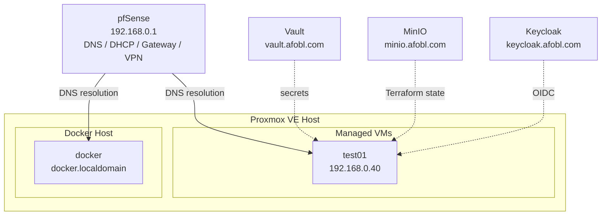
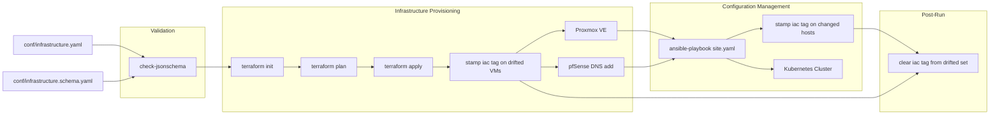
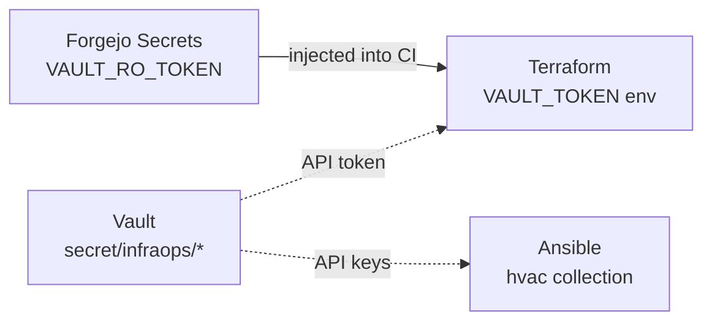

# Architecture

## Overview

Infrastructure as Code, flowing from a single, multi-tool source of truth. This platform provisions and configures virtual machines on Proxmox VE, manages DNS via pfSense Unbound, and bootstraps production-ready Kubernetes clusters — all driven by a single declarative YAML file.

The InfraOps philosophy draws a bright line between infrastructure code (for Infrastructure Engineers) and application code (for Application Engineers). Infrastructure is managed declaratively through a single source of truth; application teams consume it without touching it.

**License:** GPLv3 — see [LICENSE.md](../LICENSE.md) for full terms.

## Components

| Component | Purpose |
|-----------|---------|
| `conf/infrastructure.yaml` | Single source of truth. Defines clusters, hosts, services, platform config. |
| **Terraform** | Provisions Proxmox VMs, allocates IPs, manages DNS records via pfSense. |
| **Ansible** | Configures VMs — kernel tuning, kubeadm init/join, keepalived, haproxy, Calico. |
| **HashiCorp Vault** | Stores secrets (Proxmox API tokens, pfSense API keys). Mounted at `secret/infraops/`. |
| **MinIO** | S3-compatible object storage. Terraform state backend. |
| **pfSense / Unbound** | Firewall/router with DNS host overrides managed via REST API. |
| **Forgejo CI** | Orchestrates the full pipeline: validate → plan → apply → bootstrap. |
| **Keycloak** | OIDC identity provider for Kubernetes API authentication. |

## File Layout

```
infraops/
├── conf/
│   ├── infrastructure.yaml          # Single source of truth (not in public git)
│   ├── infrastructure_example.yaml  # Template for a fresh environment
│   └── infrastructure.schema.yaml   # JSON Schema for validation
├── terraform/
│   ├── main.tf                      # VM resources, DNS, providers
│   ├── variables.tf                 # Input variables (TF_VAR overrides)
│   ├── outputs.tf                   # Ansible inventory output
│   ├── templates/                   # Cloud-init meta-data template
│   └── .terraform.lock.hcl          # Provider lock file
├── ansible/
│   ├── ansible.cfg                  # Ansible configuration
│   ├── group_vars/all/main.yml      # Platform variables
│   ├── playbooks/
│   │   ├── site.yaml                # Entry point (imports common + k8s + final-act)
│   │   ├── common.yaml              # Baseline: accounts + patching
│   │   ├── k8s-cluster.yaml         # Full K8s bootstrap
│   │   ├── final-act.yaml           # Post-patch reboot handling
│   │   ├── k8s-drain-removed-nodes.yaml
│   │   ├── manage-iac-dns.yaml      # DNS CRUD via pfSense API
│   │   ├── manage-iac-dhcp.yaml     # DHCP ghost-lease cleanup
│   │   ├── keycloak-deploy.yaml     # Keycloak container deployment
│   │   └── keycloak-setup.yaml      # Keycloak realm/clients bootstrap
│   ├── roles/                       # Reusable Ansible roles
│   └── templates/                   # Jinja2 templates (haproxy, keepalived, kubeadm)
├── scripts/
│   ├── dns-lookup.sh                # DNS resolution helper
│   ├── validate-infra.sh            # Schema validation
│   ├── render-infra.py              # Draw.io diagram generation
│   ├── generate-schema-docs.py      # Schema → SCHEMA_REFERENCE.md
│   ├── k8s_import_context.sh        # Kubeconfig import one-liner
│   ├── restart-pfsense-dhcp.sh      # DHCP restart + ghost-lease DNS gate
│   ├── terraform-apply-with-readiness.sh
│   └── build-ci-base.sh             # CI image builder
├── docker/
│   └── ci-base/Dockerfile           # CI base image (Alpine + Terraform + Ansible)
├── .forgejo/workflows/
│   ├── enforce-iac.yaml             # Main CI/CD pipeline
│   └── deploy-k8s.yaml              # Manual k8s deployment
├── docs/                            # Documentation
└── build-release.sh                 # Release management script
```

## Network Topology



### IP Allocation

| Range | Purpose |
|-------|---------|
| `192.168.0.1` | Gateway / pfSense (static, not in pool) |
| `192.168.0.2` - `.9` | Static services (reserved) |
| `192.168.0.10` - `.39` | Assigned services (docker, etc.) |
| `192.168.0.40` - `.49` | IAC-managed VMs (10 IPs) |
| `192.168.0.100` - `.245` | DHCP pool |

## Data Flow



`infrastructure.yaml` drives both systems independently. Terraform reads it for VM provisioning; Ansible reads it for configuration. DNS (pfSense Unbound) is the only coupling point — Terraform creates records, Ansible resolves FQDNs.

Both actors stamp the `iac` state-drift tag on hosts they detect drift on (see [State Drift Tag](#state-drift-tag)). The tag is cleared from the combined drifted set only when the whole run succeeds.

## State Drift Tag

The `iac` tag is a **state-drift tag**: it marks a host as "IaC detected state drift here and acted on it." It is stamped by whichever actor detected the drift, stays visible in the Proxmox UI for the duration of the run, and is cleared only when the whole run succeeds.

### Semantics

| Tag state | Meaning |
|-----------|---------|
| `iac` present during a run | IaC detected state drift on this host and is/was acting on it. Check on it if the run didn't finish. |
| `iac` present after a failed run | Drift was detected but the pipeline errored before the final cleanup — this host needs investigation. |
| `iac` absent | Either the host never drifted, or a successful run acted on its drift and cleared the tag. |

### Who stamps it

- **Terraform** (`scripts/terraform-apply-with-readiness.sh` → `scripts/stamp-iac-tags.sh`) stamps every VM the plan changes — `create`, `replace` (`delete,create`), or in-place `update` (e.g. a RAM adjust). This includes a VM that was destroyed out-of-band and is restored as state drift: the plan reports it as `create`, so it is stamped and later cleared like any other drifted VM. Pure no-ops and pure destroys are excluded.
- **Ansible** (`scripts/configuration-management.sh` → `scripts/stamp-iac-tags.sh`) stamps every inventory host whose play recap reports `changed > 0` — Ansible's own signal that its tasks modified the host's state.

Standby (parked spare) VMs are deliberately **iac-exempt**: Terraform creates them with only the `standby` tag (never `iac`), and `extract_drifted_vms` filters anything tagged `standby` out of the drift set. The standby build step also emits no Ansible drift. They are pre-provisioned capacity, not state drift — a failed run never leaves a "please investigate" marker on them.

`stamp-iac-tags.sh` is idempotent and preserves any other tags on the host.

### Who clears it

The **last step** of `enforce-iac.yaml` (`scripts/clear-iac-tags.sh`) removes `iac` from the **union** of the two drifted sets — the VMs Terraform changed and the hosts Ansible changed — and only those. It has no `if:` gate: workflow steps fail fast, so reaching it implies the whole run (apply + readiness + config management) succeeded.

This scoping is deliberate:

- A host tagged by an **earlier failed run** but **not touched this run** keeps its tag — it was not acted on, so its drift signal stays visible for investigation.
- Terraform checks every `infrastructure_provisioning` host for drift and Ansible checks every `configuration_management` host, but typically only a **subset** drifts in any given run. The tag and its clearing track that actual subset, not the whole managed fleet.

## Standby Node Pools

Standby nodes are **pre-provisioned, parked spare VMs** that let a cluster expand without paying the full cold-build cost. The economics: a new VM costs ~20 min (clone, cloud-init double-boot, baseline, k8s base toolchain, join, RBAC); a **promoted ghost** costs ~5–8 min (boot + join + RBAC). Only the join's irreducible floor is unpaid — everything clone-ward is pre-paid while the cluster is idle.

### Model

- The SSOT's per-plane `standby` integer (default `0`) declares parked spares packed at the tail of the plane: `nodes + 1 .. nodes + standby`. `nodes` is the **active** count.
- **Terraform knows only the total** (`nodes + standby`). It provisions uniform VMs, reserves IPs/DNS, and tags ghosts `standby` (active VMs get `iac`). It never models power state — a ghost is created running, like any VM.
- **Ansible + the Proxmox API enforce the partition.** `scripts/reconcile-standby-nodes.sh --park` cleanly shuts a ghost down (qemu-guest-agent / ACPI — never suspend: a suspended VM wakes with a frozen clock and stale RAM, wrong at the moment the k8s join runs) and maintains the `standby` tag; `--wake` boots active VMs and clears the tag.
- `scripts/build-and-park-standby.sh` builds a freshly-created ghost "like any other node" (common baseline + the k8s base toolchain from `tasks/k8s-base.yaml`, shared with `k8s-cluster.yaml` Play 1) then parks it. It targets whatever is running *and* tagged `standby`, so it self-heals ghosts left running by an interrupted earlier run; already-parked ghosts are skipped (no-op).

### Lifecycle (three commits)

1. **Create** the cluster with `standby: 0` — identical to today.
2. **Add standby**: bump `standby: N` → the next run creates, boots, builds, and parks the ghosts. Cluster untouched.
3. **Promote** (fast): `nodes +k`, `standby −k` — total flat, so Terraform sees no diff and apply is a no-op. The workflow's *Wake Active Nodes* step boots the promoted ghost, config management joins it, and the remaining ghosts stay parked. Replenish later by bumping `standby` again in a separate, cluster-neutral run.

**Scale-down**: reduce `standby` in the same edit that reduces `nodes` (total shrinks) so the drained boundary node is destroyed rather than re-parked.

### Guardrails

- **iac-invisible**: ghosts are pre-provisioned capacity, not drift — no `iac` tag at creation, excluded from `extract_drifted_vms`, and the build step emits no Ansible drift. A failed run never flags a ghost for investigation.
- **Readiness gate**: standby VMs are created through the normal Terraform flow and signal readiness over NATS like any new VM, so the gate waits for their cloud-init to finish before anything configures them.
- **Version drift while parked**: solved by converge-on-promotion — the k8s base tasks are idempotent, so promotion re-pins whatever version the SSOT demands at boot time.

## CI/CD Pipeline

The `enforce-iac.yaml` workflow runs on push to `master` or manual dispatch:

```mermaid
flowchart TD
    START([Push to master]) --> CHECKOUT["Checkout"]
    CHECKOUT --> VALIDATE["Validate Infrastructure YAML<br/>check-jsonschema"]
    VALIDATE --> DIAGRAM["Generate Diagram<br/>render-infra.py"]
    DIAGRAM --> TF_INIT["Terraform Init<br/>(retry wrapper)"]
    TF_INIT --> TF_VALIDATE["Terraform Validate"]
    TF_VALIDATE --> TF_PLAN["Terraform Plan<br/>(-detailed-exitcode)"]
    TF_PLAN --> CHANGES["Check for Infrastructure Changes"]
    CHANGES --> CLUSTERS["Check Clusters"]
    CLUSTERS --> DRAIN["K8s Drain Removed Nodes"]
    DRAIN --> FIX_PERMS["Fix Terraform Dir Permissions"]
    FIX_PERMS --> CONSUMER["Ensure Readiness Poller Consumer Exists"]
    CONSUMER --> APPLY["Apply and Wait for Readiness<br/>NATS gate + failed-VM retries<br/>stamp iac tag on drifted VMs"]
    APPLY --> DHCP["Restart pfSense DHCP<br/>auto-delete ghost leases"]
    DHCP --> WAKE["Wake Active Nodes<br/>reconcile-standby-nodes.sh --wake"]
    WAKE --> GEN_INV["Generate Ansible Inventory"]
    GEN_INV --> CONFIG_MGMT["Configuration Management<br/>ansible-playbook site.yaml<br/>stamp iac tag on changed hosts"]
    CONFIG_MGMT --> BUILD_PARK["Build and Park Standby Nodes<br/>build-and-park-standby.sh"]
    BUILD_PARK --> CLEAR["Clear IaC Tags<br/>remove iac from drifted set only"]
    CLEAR --> DONE([Complete])
```



### Step Images

Every step runs in the `forgejo.afobl.com/warelock/ci-base:latest` image (Terraform, Vault, NATS CLI, kubectl, yq, ansible-core + collections, provider mirror). Ansible only runs after the NATS readiness gate (`steps.apply-wait.outputs.ready == 'true'`) and a clean pfSense DHCP/DNS check, so it never touches a half-booted VM. `Clear IaC Tags` is deliberately the last step with no gate — reaching it implies the whole run succeeded (see [State Drift Tag](#state-drift-tag)).

## Security Model

### SSH Access

- **Never SSH as `warelock`** — all remote operations use the `ansible` account.
- CI runner uses `ANSIBLE_SSH_PRIVATE_KEY` from Forgejo secrets.
- SSH public key is injected via cloud-init at VM creation.

### Vault

- **Read-only token** (`VAULT_RO_TOKEN`) — used by CI for Terraform provider auth. Path: `secret/infraops/proxmox`.
- **Read-write token** — local use only, for managing secrets.
- Vault is unsealed manually after restarts.

### Secrets Flow



### Pre-Push Hook

`githooks/pre-push` (installed via `git config core.hooksPath githooks`) blocks direct pushes to the public `github` and `dmz` remotes so `conf/infrastructure.yaml` can never leave the local repository. The source of truth lives on the private `origin` remote; the public mirrors are updated via `~/bin/push_public`, which pushes a sanitized copy of the branch with the file removed from all history. The file contains personal network configuration (IPs, hostnames, API tokens).

## Key Design Decisions

| Decision | Rationale |
|----------|-----------|
| **Stock cloud images + cloud-init** | Simpler, more portable, easier to update than golden images. Proxmox-native cloud-init handles initialization. |
| **Static IPs via pfSense Unbound** | Proxmox doesn't provide DHCP DNS registration. Static IPs + API-managed DNS records give reliable name resolution for Terraform and Ansible. |
| **YAML in git as the database** | Git provides versioning, diffing, audit trail, RBAC, backup, rollback. All major IaC tools (Terraform, Ansible, Kubernetes, Helm) use this pattern. |
| **`enforcement` tags** | `infrastructure_provisioning` → Terraform acts. `configuration_management` → Ansible acts. Both → Terraform creates, Ansible configures. Neither → ignored. |
| **`iac` state-drift tag** | The `iac` tag marks "IaC detected state drift and acted on it." Terraform stamps the VMs its plan changes; Ansible stamps the hosts its recap reports as `changed > 0`. The last workflow step clears it from the union of both drifted sets only, so a host tagged by an earlier failed run stays visible until a future run actually acts on it. |
| **One IP pool for all VMs** | `hosts[].ip_pool` (`.40-.59`) is the single pool for all IAC-managed static IPs. VIP is explicitly defined per cluster. |
| **Single source of truth** | `infrastructure.yaml` drives everything. Given a validated file, host lists are fully deterministic for both Terraform and Ansible using the same naming convention: `{type}-{cluster}-{plane}-{nn}.{domain}`. |
| **Immutable = opt-in** | `immutable` defaults to `false`. Existing hosts work without modification. When enabled, configuration management skips the host and a break-glass marker is monitored. |

## Supplementary Diagrams

A detailed draw.io diagram is generated automatically from `infrastructure.yaml`:

```bash
scripts/render-infra.py
```

This produces `infra.drawio` at the project root. Open it in draw.io for an interactive, editable architecture view.
