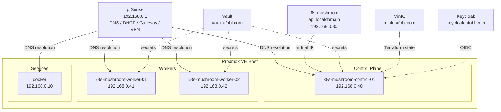
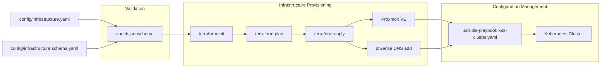
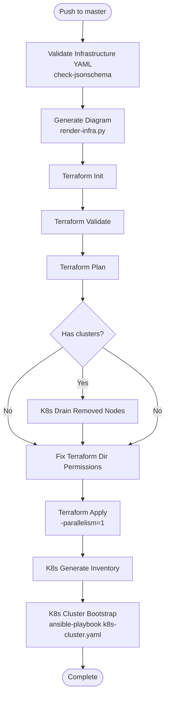
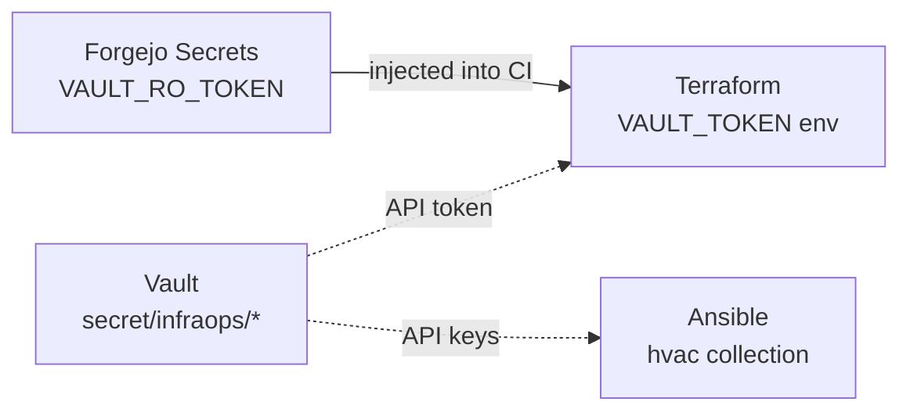

# Architecture

## Overview

Infrastructure as Code, flowing from a single, multi-tool source of truth. This platform provisions and configures virtual machines on Proxmox VE, manages DNS via pfSense Unbound, and bootstraps production-ready Kubernetes clusters — all driven by a single declarative YAML file.

The InfraOps philosophy draws a bright line between infrastructure code (for Infrastructure Engineers) and application code (for Application Engineers). Infrastructure is managed declaratively through a single source of truth; application teams consume it without touching it.

**License:** GPLv3 — see [LICENSE.md](../LICENSE.md) for full terms.

## Components

| Component | Purpose |
|-----------|---------|
| `config/infrastructure.yaml` | Single source of truth. Defines clusters, hosts, services, platform config. |
| **Terraform** | Provisions Proxmox VMs, allocates IPs, manages DNS records via pfSense. |
| **Ansible** | Configures VMs — kernel tuning, kubeadm init/join, keepalived, haproxy, Calico. |
| **HashiCorp Vault** | Stores secrets (Proxmox API tokens, pfSense API keys). Mounted at `secret/infraops/`. |
| **MinIO** | S3-compatible object storage. Terraform state backend. |
| **pfSense / Unbound** | Firewall/router with DNS host overrides managed via REST API. |
| **Forgejo CI** | Orchestrates the full pipeline: validate → plan → apply → bootstrap. |
| **Keycloak** | OIDC identity provider for Kubernetes API authentication. |

## File Layout

```
infraops/
├── config/
│   ├── infrastructure.yaml          # Single source of truth (not in public git)
│   └── infrastructure.schema.yaml   # JSON Schema for validation
├── terraform/
│   ├── main.tf                      # VM resources, DNS, providers
│   ├── variables.tf                 # Input variables
│   ├── outputs.tf                   # Ansible inventory output
│   └── .terraform.lock.hcl          # Provider lock file
├── ansible/
│   ├── ansible.cfg                  # Ansible configuration
│   ├── group_vars/all/main.yml      # Platform variables
│   ├── playbooks/
│   │   ├── site.yaml                # Entry point (imports k8s-cluster.yaml)
│   │   ├── k8s-cluster.yaml         # Full K8s bootstrap (581 lines)
│   │   ├── k8s-drain-removed-nodes.yaml
│   │   ├── manage-iac-dns.yaml      # DNS CRUD via pfSense API
│   │   └── keycloak-setup.yaml      # Keycloak deployment
│   ├── roles/                       # Reusable Ansible roles
│   └── templates/                   # Jinja2 templates (Keycloak docker-compose)
├── scripts/
│   ├── dns-lookup.sh                # DNS resolution helper
│   ├── validate-infra.sh            # Schema validation
│   ├── render-infra.py              # Draw.io diagram generation
│   ├── generate-schema-docs.py      # Schema → SCHEMA_REFERENCE.md
│   ├── k8s_import_context.sh        # Kubeconfig import one-liner
│   └── build-ci-base.sh            # CI image builder
├── snippets/
│   └── cloud-init-reboot.yaml       # Proxmox cloud-init vendor data
├── docker/
│   └── ci-base/Dockerfile           # CI base image (Alpine + Terraform + Ansible)
├── .forgejo/workflows/
│   └── enforce-iac.yaml             # Main CI/CD pipeline
├── docs/                            # Documentation
├── infrastructure_example.yaml      # Template for new deployments
└── build-release.sh                 # Release management script
```

## Network Topology



### IP Allocation

| Range | Purpose |
|-------|---------|
| `192.168.0.1` | Gateway / pfSense (static, not in pool) |
| `192.168.0.2` - `.9` | Static services (reserved) |
| `192.168.0.10` - `.39` | Assigned services (docker, VIP, etc.) |
| `192.168.0.40` - `.59` | IAC-managed VMs (20 IPs) |
| `192.168.0.100` - `.245` | DHCP pool |

## Data Flow



`infrastructure.yaml` drives both systems independently. Terraform reads it for VM provisioning; Ansible reads it for configuration. DNS (pfSense Unbound) is the only coupling point — Terraform creates records, Ansible resolves FQDNs.

## CI/CD Pipeline

The `enforce-iac.yaml` workflow runs on push to `master` or manual dispatch:



### Step Images

| Step | Image | Why |
|------|-------|-----|
| Validate YAML | `python:3.12-alpine` | Lightweight, just needs `check-jsonschema` |
| Generate Diagram | `python:3.12-alpine` | Needs `pyyaml` |
| Terraform Init/Validate/Plan | `forgejo.afobl.com/warelock/ci-base:latest` | Terraform + Vault + MinIO client |
| K8s Drain | `alpine/ansible:latest` | Ansible + kubectl |
| Terraform Apply | `deltamir/terraform-ansible:1.15.0` | Terraform + Ansible for DNS provisioning |
| K8s Bootstrap | `alpine/ansible:latest` | Ansible with all collections |

## Security Model

### SSH Access

- **Never SSH as `warelock`** — all remote operations use the `ansible` account.
- CI runner uses `ANSIBLE_SSH_PRIVATE_KEY` from Forgejo secrets.
- SSH public key is injected via cloud-init at VM creation.

### Vault

- **Read-only token** (`VAULT_RO_TOKEN`) — used by CI for Terraform provider auth. Path: `secret/infraops/proxmox`.
- **Read-write token** — local use only, for managing secrets.
- Vault is unsealed manually after restarts.

### Secrets Flow



### Pre-Push Hook

`.git/hooks/pre-push` silently drops `config/infrastructure.yaml` from pushes to `github` and `dmz` remotes. The file contains personal network configuration (IPs, hostnames, API tokens) and must never leave the local repository.

## Key Design Decisions

| Decision | Rationale |
|----------|-----------|
| **Stock cloud images + cloud-init** | Simpler, more portable, easier to update than golden images. Proxmox-native cloud-init handles initialization. |
| **Static IPs via pfSense Unbound** | Proxmox doesn't provide DHCP DNS registration. Static IPs + API-managed DNS records give reliable name resolution for Terraform and Ansible. |
| **YAML in git as the database** | Git provides versioning, diffing, audit trail, RBAC, backup, rollback. All major IaC tools (Terraform, Ansible, Kubernetes, Helm) use this pattern. |
| **`enforcement` tags** | `infrastructure_provisioning` → Terraform acts. `configuration_management` → Ansible acts. Both → Terraform creates, Ansible configures. Neither → ignored. |
| **One IP pool for all VMs** | `hosts[].ip_pool` (`.40-.59`) is the single pool for all IAC-managed static IPs. VIP is explicitly defined per cluster. |
| **Single source of truth** | `infrastructure.yaml` drives everything. Given a validated file, host lists are fully deterministic for both Terraform and Ansible using the same naming convention: `{type}-{cluster}-{plane}-{nn}.{domain}`. |
| **Immutable = opt-in** | `immutable` defaults to `false`. Existing hosts work without modification. When enabled, configuration management skips the host and a break-glass marker is monitored. |

## Supplementary Diagrams

A detailed draw.io diagram is generated automatically from `infrastructure.yaml`:

```bash
scripts/render-infra.py
```

This produces `infra.drawio` at the project root. Open it in draw.io for an interactive, editable architecture view.
